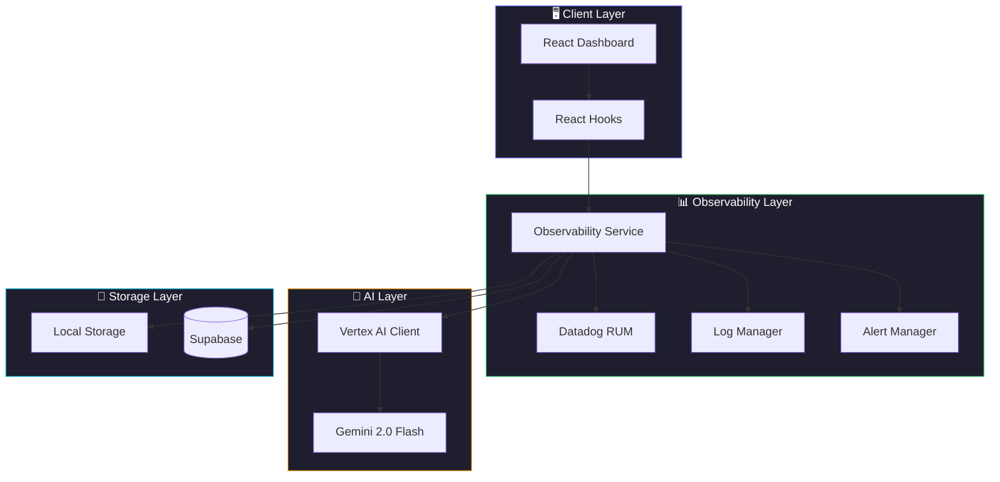
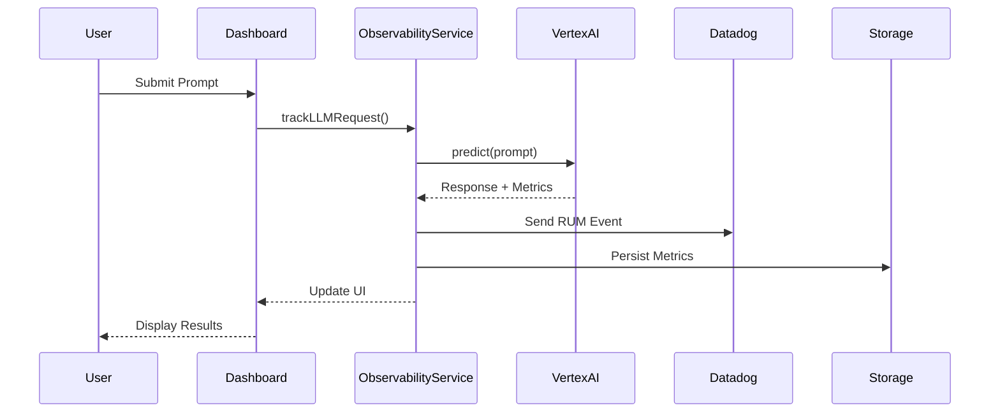
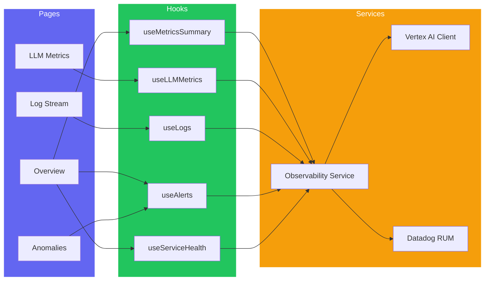
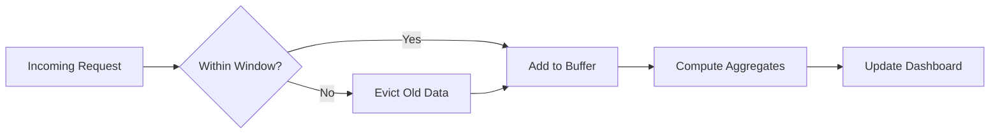
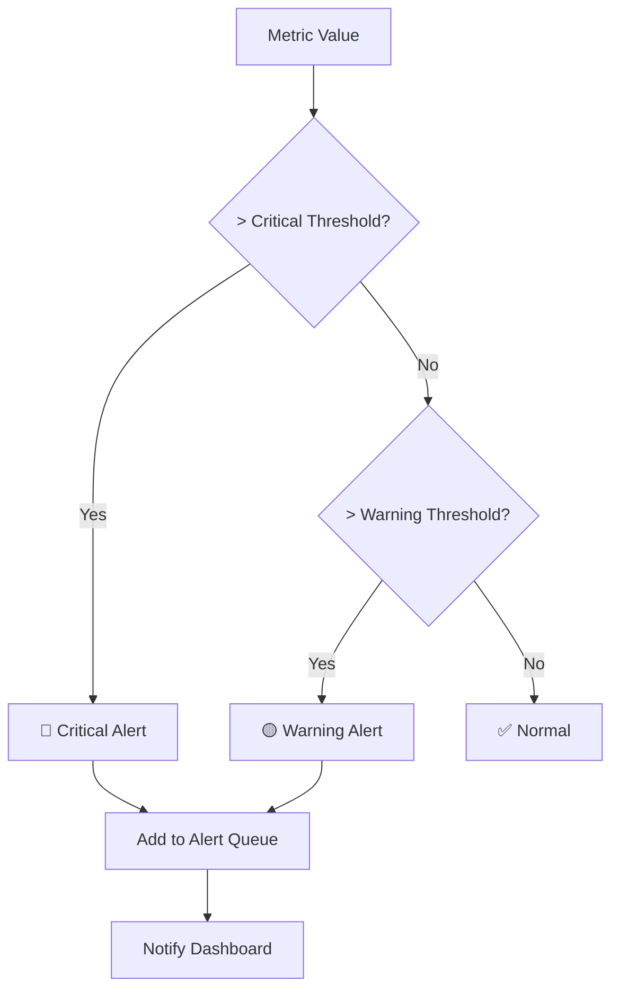

<p align="center">
  
</p>

<h1 align="center">🔮 ObservAI Hub</h1>

<p align="center">
  <strong>Enterprise-Grade LLM Observability Platform</strong>
</p>

<p align="center">
  <a href="#-features">Features</a> •
  <a href="#-architecture">Architecture</a> •
  <a href="#-quick-start">Quick Start</a> •
  <a href="#-algorithms">Algorithms</a> •
  <a href="#-acknowledgments">Acknowledgments</a>
</p>

<p align="center">
  
  
  
  
  
  
</p>

---

## 📖 Overview

**ObservAI Hub** is a comprehensive observability platform designed specifically for monitoring Large Language Model (LLM) applications. It provides real-time insights into model performance, latency tracking, token usage analytics, and anomaly detection—all powered by Datadog's enterprise monitoring infrastructure and Google's Vertex AI.

```
┌─────────────────────────────────────────────────────────────────┐
│                      🎯 ObservAI Hub                             │
│  Real-time LLM Monitoring • Anomaly Detection • Performance     │
└─────────────────────────────────────────────────────────────────┘
```

---

## ✨ Features

| Feature | Description |
|---------|-------------|
| 📊 **Real-time Metrics** | Live dashboard with request volume, latency, and token usage |
| 🧠 **LLM Analytics** | Deep observability into model performance and behavior |
| 🚨 **Anomaly Detection** | AI-specific failure mode detection and alerting |
| 📝 **Log Streaming** | Real-time log aggregation with filtering |
| 🔍 **Service Health** | Monitor Supabase, Vertex AI, and API status |
| 📈 **Time Series Charts** | Beautiful visualizations with Recharts |
| 🌙 **Dark Mode** | Sleek dark-themed UI built with shadcn/ui |

---

## 🏗 Architecture

### System Overview



### Data Flow



### Component Architecture



---

## 🚀 Quick Start

### Prerequisites

- **Node.js** >= 18.x
- **npm** or **bun** package manager
- **Datadog Account** (for RUM)
- **Google Cloud Account** (for Vertex AI)

### Installation

```bash
# 1. Clone the repository
git clone https://github.com/Shafwansafi06/observability-hub.git
cd observability-hub

# 2. Install dependencies
npm install

# 3. Set up environment variables
cp .env.example .env
```

### Environment Configuration

Create a `.env` file with the following variables:

```env
# Supabase Configuration
VITE_SUPABASE_URL=your_supabase_url
VITE_SUPABASE_ANON_KEY=your_supabase_anon_key

# Datadog RUM Configuration
VITE_DD_APPLICATION_ID=your_datadog_app_id
VITE_DD_CLIENT_TOKEN=your_datadog_client_token
VITE_DD_SITE=us5.datadoghq.com
DD_API_KEY=your_datadog_api_key

# Vertex AI / Gemini Configuration
VITE_VERTEX_AI_API_KEY=your_gemini_api_key

# Upstash Redis (Optional - for caching)
UPSTASH_REDIS_URL=your_redis_url
UPSTASH_REDIS_TOKEN=your_redis_token
```

### Running the Application

```bash
# Development mode (with hot reload)
npm run dev

# Build for production
npm run build

# Preview production build
npm run preview

# Run linting
npm run lint
```

### Access the Dashboard

Once running, open your browser and navigate to:

```
http://localhost:8080
```

---

## 🧮 Algorithms

### Metrics Aggregation

The observability service uses a **sliding window algorithm** to compute real-time metrics:



**Time-bucketed aggregation** for chart data:

```typescript
// Bucket-based time series aggregation
const bucketSize = duration / bucketCount;
for (const request of requests) {
    const bucket = Math.floor((request.timestamp - startTime) / bucketSize);
    buckets[bucket].push(request);
}
```

### Percentile Calculations

For latency metrics, we compute **P95 and P99 percentiles**:

```
P95 = values[floor(n * 0.95)]
P99 = values[floor(n * 0.99)]
```

Where `n` is the total number of sorted latency values.

### Alert Detection

The alert system uses **threshold-based detection** with configurable rules:



### Token Usage Tracking

Token consumption is tracked using **cumulative sum with time decay**:

```
tokensPerSecond = totalTokens / (currentTime - windowStart)
```

---

## 📁 Project Structure

```
observability-hub/
├── src/
│   ├── components/          # React UI components
│   │   ├── dashboard/       # Dashboard-specific components
│   │   ├── landing/         # Landing page components
│   │   ├── layout/          # Layout components (Navbar, Footer)
│   │   └── ui/              # shadcn/ui components
│   ├── hooks/               # React hooks
│   │   └── use-observability.ts  # Observability hooks
│   ├── lib/                 # Core libraries
│   │   ├── observability-service.ts  # Main observability logic
│   │   ├── datadog.ts       # Datadog RUM integration
│   │   ├── supabaseClient.ts # Supabase client
│   │   └── vertex-ai/       # Vertex AI client
│   └── pages/               # Page components
│       └── dashboard/       # Dashboard pages
├── config/                  # Configuration files
├── datadog/                 # Datadog configuration
├── vertex-ai/               # Vertex AI scripts
├── docs/                    # Documentation
└── public/                  # Static assets
```

---

## 🔧 Available Scripts

| Command | Description |
|---------|-------------|
| `npm run dev` | Start development server on port 8080 |
| `npm run build` | Build for production |
| `npm run preview` | Preview production build |
| `npm run lint` | Run ESLint |

---

## 📊 Dashboard Pages

### Overview
Real-time metrics dashboard showing:
- Total requests, average latency, tokens used
- Service health status
- Request volume and latency charts
- Active alerts

### LLM Metrics
Deep dive into LLM performance:
- Model-specific metrics
- Token throughput (tokens/sec)
- P95/P99 latency percentiles
- **Live AI Tester** - Test Gemini in real-time

### Log Stream
Real-time log aggregation:
- Filter by level (info, warning, error, critical)
- Search by service or message
- Pause/resume streaming

### Anomalies
Alert management:
- Critical and warning alerts
- Acknowledge and resolve actions
- Detection rules configuration

---

## 🙏 Acknowledgments

<p align="center">
  <a href="https://www.datadoghq.com/">
    
  </a>
  &nbsp;&nbsp;&nbsp;&nbsp;&nbsp;&nbsp;
  <a href="https://cloud.google.com/vertex-ai">
    
  </a>
</p>

### 🐕 Datadog

A huge thank you to **[Datadog](https://www.datadoghq.com/)** for providing the enterprise-grade monitoring infrastructure that powers ObservAI Hub:

- **Real User Monitoring (RUM)** - Captures user sessions, interactions, and performance metrics
- **Log Management** - Centralized log aggregation and analysis
- **APM & Tracing** - Distributed tracing for request flows
- **Dashboards** - Beautiful visualization capabilities

Datadog's comprehensive observability platform makes it possible to monitor LLM applications at scale with confidence.

### 🧠 Google Cloud Vertex AI

Special thanks to **[Google Cloud Vertex AI](https://cloud.google.com/vertex-ai)** for providing cutting-edge AI capabilities:

- **Gemini 2.0 Flash** - Lightning-fast multimodal AI model
- **Generative AI API** - Easy-to-use API for AI inference
- **Enterprise Security** - SOC 2, ISO 27001, HIPAA compliant
- **Global Infrastructure** - Low-latency inference worldwide

Vertex AI enables ObservAI Hub to demonstrate real LLM observability with production-grade AI models.

---

## 📄 License

This project is licensed under the MIT License - see the [LICENSE](LICENSE) file for details.

---

## 👨‍💻 Author

**Shafwan Safi**

- GitHub: [@Shafwansafi06](https://github.com/Shafwansafi06)

---

<p align="center">
  <strong>Built with ❤️ for the AI observability community</strong>
</p>

<p align="center">
  <sub>ObservAI Hub - Making LLM monitoring accessible to everyone</sub>
</p>
